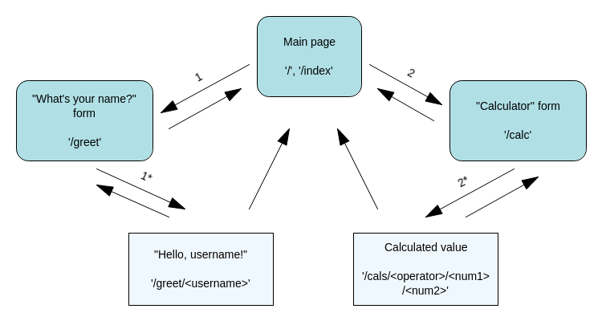
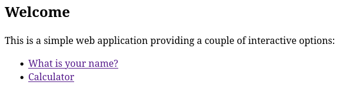
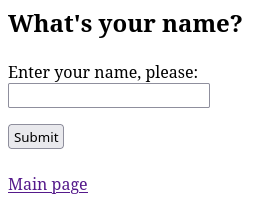
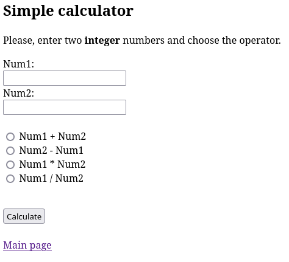
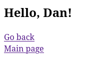
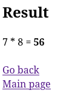
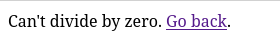

# Flask, проект №1

В рамках знакомства с основами микрофреймворка Flask написал свое первое web-приложение.

Необходимый теоретический минимум подчерпнул из учебных материалов Hexlet[^hexlet-courses], а закрепить все на практике побудил [гайд](https://www.digitalocean.com/community/tutorials/how-to-create-your-first-web-application-using-flask-and-python-3).

[^hexlet-courses]: Основная теория
    - ["Ключевые аспекты веб-разработки"](https://ru.hexlet.io/courses/python-web-development);
    - ["Протокол HTTP"](https://ru.hexlet.io/courses/http_protocol);
    - ["Python: Веб-разработка (Flask)"](https://ru.hexlet.io/courses/python-flask).

Файлы проекта:
- [приложение (код)](app_files/app.py); 
- [шаблоны веб-страниц](app_files/templates). 

### Краткое описание результатов

Это проект уровня "Hello, world!", и чтобы наработки смотрелись не слишком уныло, я решил немного усложнить задачу и добавить немного интерактива с помощью форм на отдельных web-страницах.

Главная страница:

С главной страницы пользователь может перейти к одной из двух форм:
1. ввод имени;

2. простой калькулятор;

Пользователь заполняет форму и нажимает на кнопку отправки. Происходит отправка запроса на сервер (переход по URL). URL содержит данные, которые пользователь ввел в форму. Программа-обработчик на сервере (функция на Python) использует эти данные для заполнения шаблона web-страницы, которую сервер вернет в ответ клиенту (страница, на которую попадем после отправки формы).

Пример результата отправки формы с именем:

Пример расчета выражения `7*8`:

Для калькулятора, в обработчике предусмотрена проверка исключительной ситуации "деление на ноль". В этом случае пользователь получит соответствующее сообщение:

---

[Отчет о проделанной работе](noted.md)
